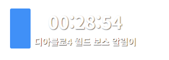

# Diablo4Boss

Diablo4 World Boss 알림이

# 라이선스
이 프로그램을 판매하는 등 상업적으로 이용하시면 안됩니다. 그 이외 방송에는 얼마든지 이용하셔도 됩니다.

# 스타일
1. boss_circle.html : 원형 스타일

2. boss_oblong.html : 바형 스타일

# OBS 설정 사이즈
1. 원형 스타일은 너비 300 높이 300 으로 불러오신 뒤 빨간 사각형으로 크기 조절 하시면 됩니다.
2. 바형 스타일은 너비 300 높이 100 으로 불러오신 뒤 빨간 사각형으로 크기 조절 하시면 됩니다.

# OBS 설정용 주소
1. 원형 : https://minisv.github.io/Diablo4Boss/boss_circle.html
2. 바형 : https://minisv.github.io/Diablo4Boss/boss_oblong.html

# 커스텀 사운드 사용하기
커스텀으로 사운드를 바꿔서 사용하기 위해서는 impact.mp3 라는 파일을 다른파일로 읽어오셔야 합니다.
이 프로젝트를 다운로드 받으신 다음, impact.mp3 를 원하시는 사운드로 바꾸시고 OBS 셋팅 해 주세요.
